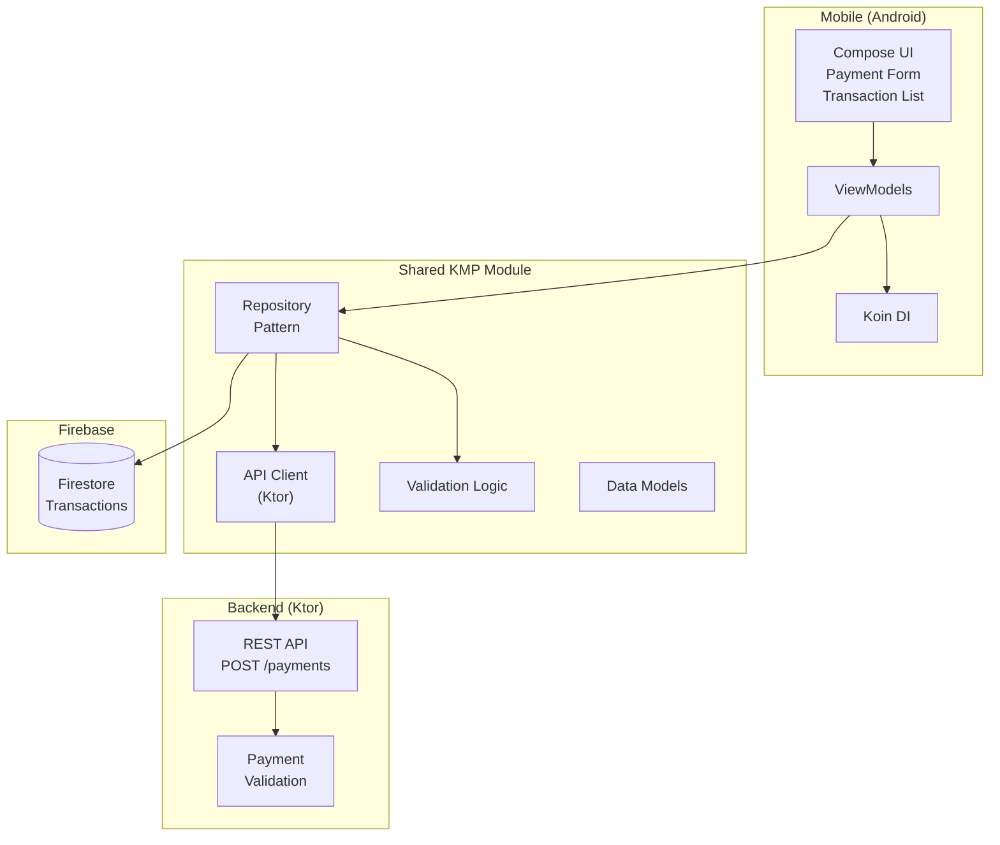

# Cashi Payment App

A production-quality FinTech payment application built with **Kotlin Multiplatform (KMP)**. This app allows users to send payments to recipients and view transaction history, with real-time updates from Firebase Firestore.

## Features

- **Send Payment**: Enter recipient email, amount, and select currency (16 supported currencies)
- **Transaction History**: Real-time updates from Firestore with status indicators
- **Cross-Platform**: Shared business logic between Android (and potentially iOS/Web)
- **Backend API**: Ktor server with validation and mock payment processing
- **Comprehensive Testing**: BDD tests with Spek, unit tests, UI tests with Appium, and performance testing with JMeter

## Architecture



### Data Flow

1. User enters payment details in Android app (Compose UI)
2. Payment is validated in shared KMP module (client-side validation)
3. Validated payment is sent to Ktor backend via HTTP POST /payments
4. Backend processes payment and returns success/failure response
5. Successful payment is saved to Firestore by the client app
6. Transaction history updates in real-time via Firestore snapshots

## Technology Stack

| Component | Technology |
|-----------|------------|
| **Platform** | Kotlin Multiplatform (KMP) |
| **UI Framework** | Jetpack Compose / Compose Multiplatform |
| **Backend** | Ktor (Netty engine) |
| **Database** | Firebase Firestore (GitLive KMP SDK) |
| **Networking** | Ktor Client with Content Negotiation |
| **Dependency Injection** | Koin |
| **Serialization** | Kotlinx Serialization |
| **Testing (BDD)** | Spek Framework with JUnit 5 |
| **Testing (UI)** | Appium with WebdriverIO |
| **Testing (Performance)** | Apache JMeter |

## Project Structure

```
CashiMobileAppChallenge/
├── androidApp/                  # Android application module
│   └── src/main/
│       └── kotlin/com/cashi/challenge/
│           └── MainActivity.kt  # Entry point with Koin initialization
├── composeApp/                  # Shared Compose UI (KMP)
│   └── src/commonMain/kotlin/
│       └── com/cashi/challenge/
│           ├── App.kt           # Navigation and app root
│           └── ui/
│               ├── screens/
│               │   ├── PaymentScreen.kt         # Payment form UI
│               │   └── TransactionHistoryScreen.kt # Transaction list UI
│               └── viewmodel/
│                   ├── PaymentViewModel.kt
│                   └── TransactionHistoryViewModel.kt
├── server/                      # Ktor backend
│   └── src/main/kotlin/
│       └── com/cashi/challenge/
│           ├── Application.kt   # Ktor app configuration
│           └── routes/
│               └── PaymentRoutes.kt  # POST /payments endpoint
├── shared/                      # Shared KMP business logic
│   └── src/
│       ├── commonMain/kotlin/
│       │   └── com/cashi/challenge/
│       │       ├── domain/
│       │       │   ├── models/
│       │       │   │   └── Payment.kt        # Payment, Currency, PaymentStatus
│       │       │   ├── validation/
│       │       │   │   └── PaymentValidator.kt # Validation logic
│       │       │   └── usecases/
│       │       │       ├── ProcessPaymentUseCase.kt
│       │       │       └── GetTransactionHistoryUseCase.kt
│       │       ├── data/
│       │       │   ├── api/
│       │       │   │   └── PaymentApiClient.kt    # Ktor HTTP client
│       │       │   └── repository/
│       │       │       └── PaymentRepository.kt   # Firestore operations
│       │       └── di/
│       │           └── CommonModule.kt           # Koin DI configuration
│       └── jvmTest/kotlin/
│           └── com/cashi/challenge/bdd/
│               ├── PaymentValidationSpek.kt    # BDD validation tests
│               ├── PaymentProcessingSpek.kt    # BDD processing tests
│               └── PaymentValidatorTest.kt     # Unit tests
├── appium-tests/                # UI automation tests
│   ├── payment-flow-test.js     # Appium test script
│   └── package.json
└── jmeter/                      # Performance testing
    └── payment-load-test.jmx     # JMeter test plan
```

## Prerequisites

- **JDK 17** or higher
- **Android Studio** (latest stable version)
- **Android SDK** with API 36
- **Node.js** (for Appium tests)
- **Apache JMeter** (for performance testing)

**Note**: Firebase Firestore is used for data persistence. A Firebase project with Firestore enabled is required to run the app with full functionality.

## Setup

### 1. Clone the Repository

```bash
git clone <repository-url>
cd CashiMobileAppChallenge
```

### 2. Build the Project

```bash
# Windows
.\gradlew.bat :androidApp:assembleDebug

# macOS/Linux
./gradlew :androidApp:assembleDebug
```

## Running the Application

### Start the Backend Server

```bash
# Windows
.\gradlew.bat :server:run

# macOS/Linux
./gradlew :server:run
```

The server starts on `http://localhost:8080`

### Run Android App

1. Start Android emulator or connect physical device
2. Run from Android Studio, or:

```bash
.\gradlew.bat :androidApp:installDebug
```

### Test the Backend API

```bash
curl -X POST http://localhost:8080/payments \
  -H "Content-Type: application/json" \
  -d '{"recipientEmail":"test@example.com","amount":100.00,"currency":"USD"}'
```

## Testing

### Run BDD and Unit Tests

```bash
# Run all JVM tests (includes Spek BDD tests and unit tests)
.\gradlew.bat :shared:jvmTest

# View test report
shared/build/reports/tests/jvmTest/index.html
```

**Test Coverage:**
- **PaymentValidationSpek**: 10 BDD scenarios for validation
- **PaymentProcessingSpek**: 9 BDD scenarios for payment flow
- **PaymentValidatorTest**: 22 unit tests for validation logic

### Run UI Tests with Appium

**Prerequisites:**
```bash
# Install Appium globally
npm install -g appium

# Install UIAutomator2 driver
appium driver install uiautomator2
```

**Run Tests:**
```bash
# 1. Start Appium server
appium

# 2. In another terminal, navigate to appium-tests
cd appium-tests
npm install

# 3. Run the test
node payment-flow-test.js
```

### Run Performance Tests with JMeter

**Prerequisites:**
- Download Apache JMeter from [jmeter.apache.org](https://jmeter.apache.org/)
- Extract and run `jmeter.bat` (Windows) or `jmeter` (macOS/Linux)

**Run Test:**
1. Start the backend server: `.\gradlew.bat :server:run`
2. Open JMeter GUI
3. File → Open → Select `jmeter/payment-load-test.jmx`
4. Click "Start" (green play button)

**Test Configuration:**
- 5 concurrent users (threads)
- 10 iterations per user
- 5-second ramp-up time
- POST requests to `/payments` endpoint
- Response assertions for HTTP 200 and SUCCESS status

**Results:**
- View Results Tree (detailed request/response)
- Summary Report (statistics)
- Graph Results (response time visualization)
- Aggregate Report (saved to `jmeter/results/`)

## Architecture Decisions

### Why Kotlin Multiplatform?

- **Shared Business Logic**: Payment validation, API calls, and data models are shared between platforms
- **Native UI**: Each platform can use native UI (Android = Jetpack Compose, iOS = SwiftUI)
- **Firebase Integration**: GitLive Firebase SDK provides KMP-compatible Firestore access
- **Future Extensibility**: Easy to add iOS, Web (Wasm), or Desktop targets

### Why Ktor for Backend?

- **Kotlin Native**: Same language as client code
- **Lightweight**: Minimal overhead for simple API endpoints
- **Content Negotiation**: Built-in JSON serialization with Kotlinx
- **Mock Server**: Suitable for development and testing

### Why Spek for BDD?

- **Kotlin DSL**: Native Kotlin syntax, no external feature files
- **JUnit 5 Integration**: Works with standard test runners
- **Readability**: `describe`/`it` blocks read like specifications
- **IDE Support**: Excellent integration with IntelliJ IDEA

## Supported Currencies

The app supports 16 major international currencies:

- **USD** - US Dollar
- **EUR** - Euro
- **GBP** - British Pound
- **JPY** - Japanese Yen
- **CAD** - Canadian Dollar
- **AUD** - Australian Dollar
- **CHF** - Swiss Franc
- **CNY** - Chinese Yuan
- **INR** - Indian Rupee
- **SGD** - Singapore Dollar
- **NZD** - New Zealand Dollar
- **SEK** - Swedish Krona
- **NOK** - Norwegian Krone
- **DKK** - Danish Krone
- **PLN** - Polish Zloty
- **MXN** - Mexican Peso

## Transaction Limits

- **Minimum**: $0.01 (or equivalent)
- **Maximum**: $1,000,000 (or equivalent)
- **Precision**: 2 decimal places (cents)

## Development Guidelines

### Adding a New Currency

1. Add to `Currency` enum in `shared/src/commonMain/kotlin/domain/models/Payment.kt`
2. Update `PaymentValidator` error message to include new currency
3. Add BDD test scenario in `PaymentValidationSpek.kt`
4. Add unit test in `PaymentValidatorTest.kt`

### Adding a New Test

**BDD Test (Spek):**
```kotlin
describe("Given a user [scenario]") {
    val request = PaymentRequest(...)
    it("should [expected outcome]") {
        val result = validator.validate(request)
        // assertions
    }
}
```

**Unit Test:**
```kotlin
@Test
fun `[descriptive test name]`() {
    val request = PaymentRequest(...)
    val result = validator.validate(request)
    // assertions
}
```

## Troubleshooting

### Backend Connection Issues

- Verify server is running: `http://localhost:8080`
- For Android emulator: Use `10.0.2.2` instead of `localhost`
- Check firewall settings for port 8080

### Firebase Issues

- Firebase configuration (`google-services.json`) must be present in `androidApp/src/main/`
- Firestore rules must allow read/write operations for the app to function

### Test Failures

- Run with `--rerun-tasks`: `.\gradlew.bat :shared:jvmTest --rerun-tasks`
- Check test report HTML for detailed error messages
- Ensure JUnit Platform is configured for Spek tests

## Contributing

1. Create feature branch: `git checkout -b feature/name`
2. Make changes with tests
3. Run all tests: `.\gradlew.bat :shared:jvmTest`
4. Commit with descriptive messages
5. Push and create pull request

## License

This project is for technical assessment purposes.

## Resources

- [Kotlin Multiplatform Documentation](https://kotlinlang.org/docs/multiplatform.html)
- [Ktor Server Documentation](https://ktor.io/docs/server.html)
- [Koin DI Documentation](https://insert-koin.io/docs/quickstart/kmp/)
- [GitLive Firebase](https://github.com/GitLiveApp/firebase-kotlin-sdk)
- [Spek Framework](https://www.spekframework.org/)
- [Appium Documentation](http://appium.io/docs/en/latest/)
- [Apache JMeter](https://jmeter.apache.org/)

---

**Last Updated**: February 2026  
**KMP Version**: 2.3.10  
**Compose Multiplatform**: 1.10.1
